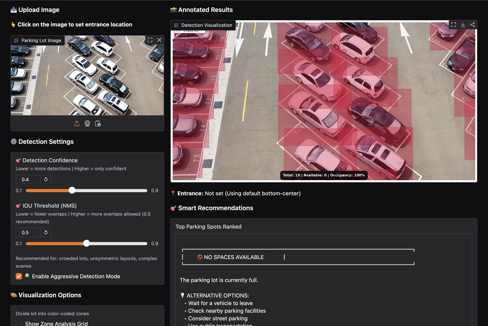

# 🚗 Smart Parking Detection System

An AI-powered parking detection system that identifies parking occupancy from images and videos with an interactive chatbot interface.

Deployed using Gradio and Hugging Face Spaces.

---

## 🔥 Live Demo

👉 Try the app here:  
https://huggingface.co/spaces/omerfarooq223/parking-detection-system

---

## ✨ Features

- Parking detection from images
- Parking detection from videos
- Interactive AI chatbot assistance
- User-friendly Gradio interface
- Cloud deployment

---

## 🧠 Model

The detection model was trained on a custom parking dataset.

Model weights are hosted on Hugging Face.

---

## 🛠️ Tech Stack

- Python
- YOLO / Computer Vision
- Gradio
- Hugging Face Spaces

---

## 📷 Results

### Interface

### Image Detection

---

## 📂 Project Structure

app.py
requirements.txt
screenshots/
samples/

---

## ▶️ Run Locally

pip install -r requirements.txt
python app.py

---

## 🚀 Future Improvements

- Real-time CCTV integration
- Parking slot availability counter
- Mobile application integration
- Cloud API deployment
- Smart city integration

---

## 📌 Applications

- Smart parking management
- Shopping malls and airports
- Traffic monitoring systems
- Urban planning

---

## 👤 Author

Muhammad Umar Farooq
